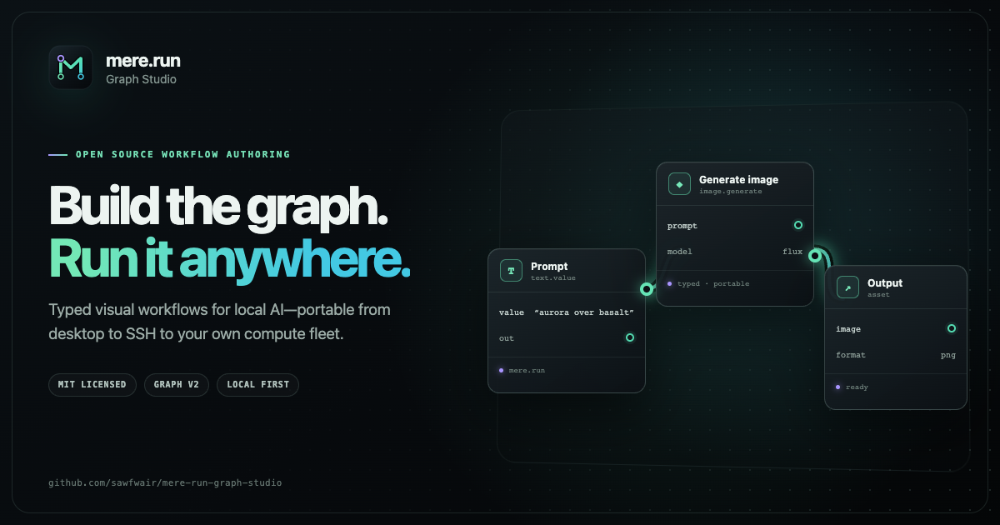

# Mere Graph Studio

[](https://github.com/sawfwair/mere-run-graph-studio/actions/workflows/check.yml)

Mere Graph Studio is the optional visual authoring and operations app for
portable `mere.run` workflow graphs. The same graph document runs locally,
over SSH, or through Relay; Studio never invents a second execution contract.

The project is pre-1.0 and under active development. Workflow contracts are
versioned, but UI and integration details may still change between releases.



## What works

- typed XYFlow canvas with catalog-driven ports and compatibility-checked connections;
- persistent Easy and Pro presentation modes that preserve the same graph and
  execution target while scaling from essential controls to full authoring;
- Run-as-App: a run-only surface generated from a graph's inputs and outputs —
  exposed fields become a form, outputs become a results gallery, and the whole
  app is shared as one portable `.meregraph.json`;
- variations that fan one setup into many runs by sweeping a seed, number, or
  choice, then compare the results side by side — unmetered on your own fleet;
- a model chip on generation nodes to swap the model in place, or race the same
  graph across models and compare — offering only models the target executor
  reports as installed, never an invented list;
- portable-graph model handling: when an imported graph references a model that
  is not installed on the target, the node and App view flag it, offer to swap
  it, and — when another paired executor has it — offer to run there, without
  ever rewriting the graph or blocking the run;
- one-click model install: pull a missing model straight from the node chip or
  the App view — a review sheet first shows the download size, free disk, and any
  usage terms to accept (from `mere.run model pull --preflight --json`), then a
  live progress bar tracks the pull to completion and refreshes the installed
  set; hosted Studio installs on the paired fleet through Relay model-plans;
- searchable command palette, keyboard navigation, contextual help, and
  non-blocking operation feedback;
- first-class graph outputs and ordering-only dependencies;
- document-wide undo and redo, dirty-state tracking, and local recovery;
- catalog-driven nested object and array editors with typed reference controls;
- first-class creative material cards for prompts, scalar values, seeds,
  choices, joins, templates, enhancement, and image description;
- promote-to-material and inline-back authoring with reusable nested references;
- canvas-native graph input cards with typed wiring and inline media previews;
- native multi-file drop that copies media into the workspace and creates one
  graph input per file while the workflow keeps named references;
- source-correlated scalar and media galleries on producing canvas nodes, with
  variant navigation and full-screen inspection;
- sidecar-only groups, notes, saved selections, alignment, and automatic layout;
- reusable workflow programs and modules with map and branch visualization;
- core and plugin-provider node catalogs;
- separate workflow, inputs, and editor sidecar files;
- one-file `.meregraph.json` project import and export without changing the
  executable graph contract;
- validation, executor-aware preflight, and side-by-side capability comparison;
- local, SSH, and Relay submission;
- streamed run inspection with node attempts, cache evidence, logs, lifecycle
  receipts, artifact previews, hashes, cancellation, local resume, retry, and
  selective verified remote fetch;
- native workflow templates supplied by `mere-run-plugins`, parameter forms,
  and confined local template publishing;
- conservative ComfyUI API-prompt inspection and import;
- editable executable JSON with round-trip back to the canvas;
- offline-first native operation with no account or network requirement;
- workspace-confined project and run paths.

## Install and run

Graph Studio is a Tauri 2 desktop app for macOS, Windows, and Linux. The app
bundles the React editor and its Rust orchestration host, so it does not require
Python, Node.js, or a browser at runtime.

On first launch, Studio asks for:

- a local workspace for project documents and run records;
- the public `mere.run` executable used for graph catalogs, validation,
  preflight, and execution;
- the optional workflow-tools executable used for templates, programs, and
  Comfy import.

The selected paths are stored in the platform application-data directory, not
in graph documents. They can be changed later from Desktop settings.

| Platform | Native packages |
| --- | --- |
| macOS Apple Silicon and Intel | `.app` and `.dmg` |
| Windows x64 | `.msi` and NSIS setup executable |
| Linux x64 | `.deb` and AppImage |

Local execution still requires a compatible `mere.run` build for the host
platform. SSH and Relay targets remain portable because Studio sends the same
immutable graph contract through the configured public client.

## Offline local Studio

The desktop app is the complete local product. Launching it, authoring and
saving projects, loading the local catalog, validation, preflight, and local
execution never require Mere World authentication or network access. Studio
invokes the installed `mere.run` executable through its Rust host.

Mere World identity is requested only by cloud/Relay surfaces. Selecting local
execution does not initialize an OAuth flow. Studio still works when workflow
tools are absent; only templates, program compilation, and Comfy import are
disabled.

## Hosted Studio

`https://studio.mere.run` serves the same React/XYFlow editor as the desktop
app. Mere World supplies OAuth 2.0 Authorization Code + PKCE identity, the
Studio Worker stores the four project documents in an account-scoped Durable
Object, and Relay places immutable jobs on the user's paired Nodes.

The hosted site never runs models and never stores provider credentials. Its
access and refresh tokens are HttpOnly cookies; the browser reaches only a
same-origin allow-listed proxy. Node catalogs are reported live through Relay,
so cloud authoring cannot silently retain an older built-in schema.

Run the hosted stack locally on its registered callback origin:

```bash
pnpm cloud:dev # http://127.0.0.1:8788
```

Build and validate the Worker without publishing:

```bash
pnpm cloud:dry-run
```

See [Hosted Studio](docs/cloud.md) for the trust, storage, and deployment
boundaries and [Authentication](docs/authentication.md) for the explicit
local, hosted, and Node identity split.

Easy mode keeps the canvas, runs, library, inspector, required arguments, and
executor target in view. Pro mode adds Program, JSON, Prepare, full argument
editing, graph organization, and advanced run operations. Switching modes is a
presentation change only: it never rewrites the graph, inputs, sidecar, program,
or selected executor.

## Develop

Prerequisites are Node.js `20.19+` (or `22.12+`), the `pnpm` version declared in
`package.json`, a stable Rust toolchain, and the platform packages required by
[Tauri 2](https://v2.tauri.app/start/prerequisites/). The browser harness uses
Playwright Chromium unless Google Chrome is available on macOS.

```bash
pnpm install --frozen-lockfile
pnpm exec playwright install chromium
pnpm hooks:install
pnpm complexity
pnpm preflight
./scripts/check.sh
```

`pnpm preflight` is the authoritative local commit gate. It runs strict
type-aware lint with zero warnings, a complexity ratchet, TypeScript checks,
coverage-gated web and Worker tests, Rust formatting, and desktop/mobile browser
smoke captures. `pnpm complexity` prints Radon-style A-F McCabe bands for
JavaScript/TypeScript and enforces Clippy's cognitive-complexity ceiling for
Rust. The tracked pre-commit hook runs the same gate; `./scripts/check.sh` is the
full publication gate with Cargo tests, builds, and the Cloudflare dry run.

Launch the native app with hot reload:

```bash
pnpm desktop:dev
```

The Tauri development command starts Vite automatically. Opening the Vite URL
directly displays a development instruction instead of starting a second local
service:

```bash
pnpm dev
```

## Package and release

Build the native package for the current platform:

```bash
pnpm desktop:build
```

Tagged `graph-studio-v*` commits run the release matrix for macOS Apple Silicon,
macOS Intel, Windows x64, and Linux x64, then attach installers to a draft GitHub
release. macOS signing/notarization and Windows Authenticode signing activate
when their documented repository secrets are present; unsigned Apple Silicon
CI builds use an ad-hoc signature.

Release checksums are produced by the repository's Node-based release utility,
which runs on the same Node toolchain already required for the frontend build.
Immutable bundle reuse across local, SSH, and Relay is owned and tested by
`mere.run`; Studio does not ship a second acceptance or packaging system.

## Ownership

| Repository | Owns |
| --- | --- |
| `mere.run` | graph contracts, validation, workers, executors, run artifacts |
| `mere-run-plugins` | provider SDK, templates, compiler, Comfy bridge |
| `mere-run-graph-studio` | offline desktop and hosted authoring; account-scoped cloud project UX; diagnostics and run operations |
| `relay-mere-run` | hosted graph queue, scheduling, node and fleet lifecycle |

See [Architecture](docs/architecture.md), [Product](docs/product.md),
[Compatibility](docs/compatibility.md), [Desktop distribution](docs/distribution.md),
and the [Roadmap](docs/roadmap.md).

## Community and license

Mere Graph Studio is available under the [MIT License](LICENSE). Contributions
are welcome; see [CONTRIBUTING.md](CONTRIBUTING.md), the
[Code of Conduct](CODE_OF_CONDUCT.md), [support guidance](SUPPORT.md), and the
[security policy](SECURITY.md) before opening a report or pull request.

The source logo, application icons, and social artwork are also MIT-licensed;
see [BRAND.md](BRAND.md) for the design system and reproducible asset workflow.
Trademark law may still apply to project and company names, and reuse must not
imply endorsement by mere.run or Sawfwair.
