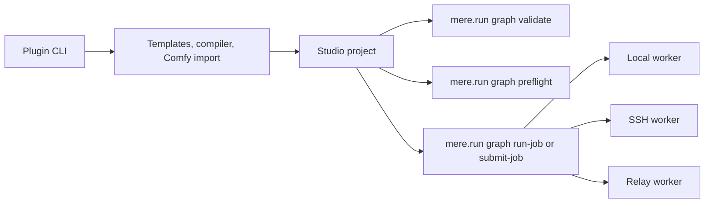
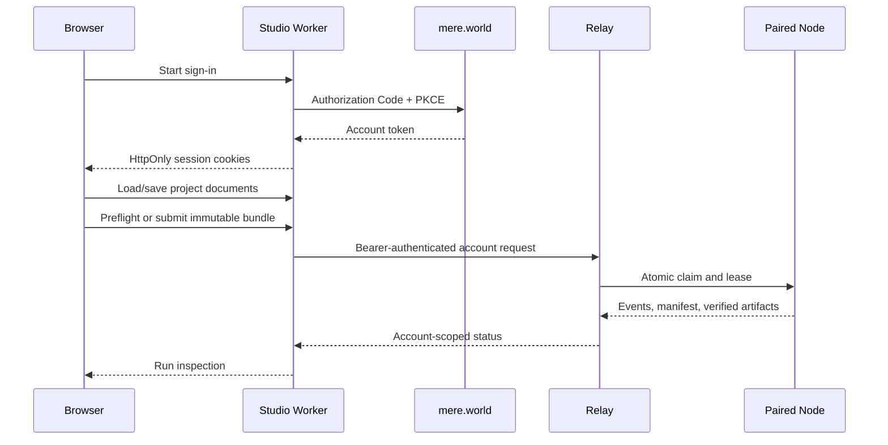

# Architecture

## Authority

Studio is a client of the portable graph system. It does not reimplement graph
validation, model resolution, scheduling, or execution. Every authoritative
operation launches a public command and consumes its JSON response.

## Project files

Each project is four independent documents:

- `<name>.workflow.json`: executable graph;
- `<name>.inputs.json`: supplied graph inputs;
- `<name>.studio.json`: positions, viewport, groups, notes, saved selections,
  and UI state;
- `<name>.program.json`: optional reusable module, map, branch, and parallel
  source that compiles to the executable graph.

The editor sidecar must never change graph fingerprints or execution behavior.
Programs are declarative source documents; the compiled workflow graph remains
the only execution contract.

Real-machine acceptance exports that graph once, records a SHA-256 lock for the
complete job bundle, and passes the same bundle path to `graph run-job` and
`graph submit-job`. Executor-specific receipts and mutable run directories stay
outside the export.

For transfer, those documents can be wrapped in one
`mere.run/graph-studio-project.v1` JSON file. Import validates and separates the
documents again. The wrapper carries no commands, credentials, executor
profiles, or runtime behavior.

## Surfaces

The React application talks through one typed `StudioRuntime` interface with
two transport adapters:

- the shipped Tauri 2 desktop app invokes a native Rust host over Tauri IPC;
- hosted mode uses same-origin Cloudflare Worker APIs for private project
  storage and an allow-listed proxy to the account's Relay graph API.

Neither transport changes graph or project semantics. The desktop host is
compiled into every macOS, Windows, and Linux installer and operates without an
account or network connection. The hosted adapter uses account-scoped storage
and Relay instead of invoking commands in the browser.

Easy and Pro are React presentation states, persisted independently from the
project documents. View coercion only prevents an Easy-mode session from
displaying Pro-only workspaces; it does not remove program, JSON, preparation,
sidecar, or run data. Responsive catalog and inspector views reuse the same
components as the desktop columns.

The Rust desktop host owns only local orchestration:

- safe project-file persistence;
- public CLI process invocation;
- ephemeral request files;
- durable Studio run indexing;
- local run inspection and lifecycle receipts;
- confined delivery of artifacts declared by the authoritative run manifest;

The native app loads bundled assets and uses Tauri's scoped IPC capability.
It has no sign-in gate. Mere World identity is introduced only when a user
chooses the hosted/Relay surface.

## Hosted lifecycle

The Studio Durable Object stores workflow, inputs, sidecar, and optional
program under separate keys. Relay remains the sole authority for job state,
placement, attempts, leases, and artifacts. Nodes report their authoritative
`mere.run graph catalog --json` document when they connect; Relay aggregates
that live catalog for the editor and retains its exact provider pins for
placement.

## Desktop lifecycle

The Rust host discovers `mere.run` and optional workflow tools from the process
path plus conventional per-user install locations. First-run setup confirms the
resolved commands and workspace using native file dialogs. Configuration lives
in the platform application-data directory, while all portable project files
remain under the selected workspace.

Long-running graph commands execute in child processes owned by the Rust host.
The host persists Studio run records before launch, streams run state through
the shared inspection model, and can cancel a child without granting the webview
arbitrary shell access. Artifact reads are confined to paths declared by the
authoritative run manifest.

It does not decode model internals or execute graph nodes itself.

## Authentication boundary

Local desktop operation has no authentication dependency. Tauri starts the Rust
host, reads and writes the selected local workspace, and invokes the installed
`mere.run` command directly. Authoring, validation, local preflight, and local
execution continue to work when the network is unavailable.

Hosted Studio requires Mere World Authorization Code + PKCE because project
storage and Relay access are account scoped. Mere Node uses a separate OAuth
device authorization grant: it displays a user code for `mere.world/device`,
polls Relay for approval, stores rotating access and refresh tokens in its
private application-config file, and authenticates the Relay WebSocket with a
bearer token. Neither flow requires a callback server on the Node or desktop
Studio machine.

See [Authentication](authentication.md) for the complete surface matrix.

## Security

- confine all project and run paths to the selected workspace;
- reject oversized requests and path traversal;
- pass secrets by name only;
- keep native operation account-free and network-independent;
- keep OAuth access and refresh tokens in HttpOnly same-site cookies;
- proxy only the explicit Relay status, fleet, and graph-job API paths;
- deny cross-origin cookie-authenticated mutations;
- invoke fixed public commands, never arbitrary shell text.

## Failure boundaries

- A missing `mere.run` executable blocks startup.
- Missing workflow tools disable templates and Comfy import without blocking
  core authoring.
- CLI stdout is decoded as a JSON document and stderr remains diagnostic.
- Remote job identifiers stay transport references and never enter executable
  graph documents.
- Studio records survive restart, while authoritative execution state remains
  in the standard run directory or remote executor.
